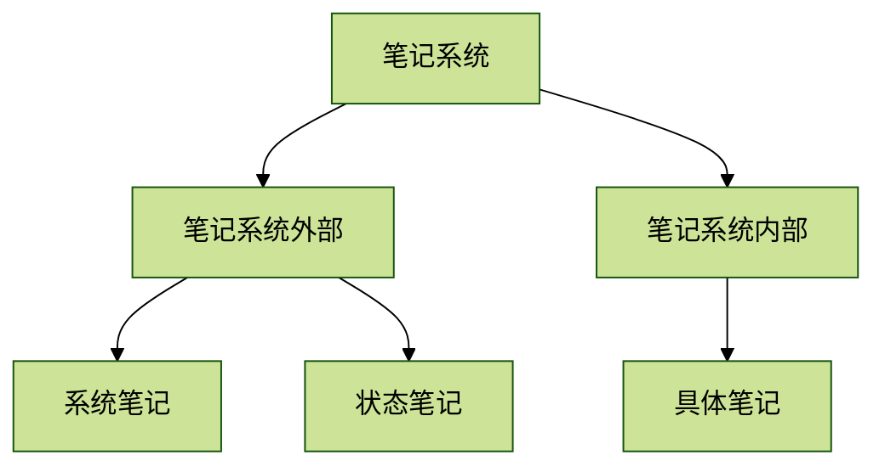
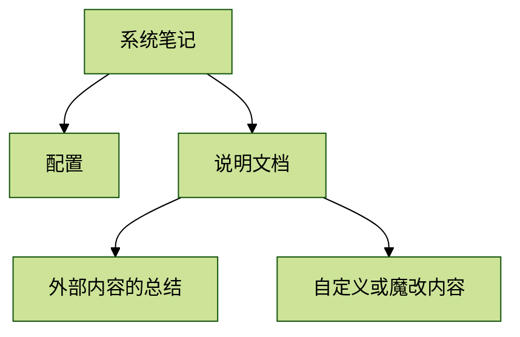

<!--more-->

## 笔记的本质

借用TiddlyWiki里一切都是条目的概念，笔记系统里的一切都是笔记。这个概念最早可以追溯到liunx系统，在此系统下一切都是文件。一切都是笔记意味着什么呢，任何我们想保留在此系统的，想在此系统组织的事物都是笔记。可以说，笔记的本质就是笔记本身。

因此，我把笔记系统分成外部和内部。外部主要是指插件和代码层面的，这些也是笔记。这些笔记构建了整个系统运转，是笔记系统的骨架和支撑。内部则是指具体的笔记，读书笔记也好，任务管理也好，都可以看作是具体的笔记。

外部与内部并非割裂的。具体来说，当你有了一个场景后，比如我要留下阅读笔记，就需要插件或代码来构建这个场景的实现。比如是否要增加日期，是作为标题还是作为字段，是否具有格式要求，浏览起来是怎样的。当外部场景搭建起来后，内部笔记只需要不断填充即可。

目前还没有谈到笔记软件，但具体来说，任何一个笔记软件都不可避免有配置文件，只是多或少。像TiddlyWiki或Obsidian这种需要自己搭建的笔记软件，会有相当多的配置文件。除了配置文件还需要有说明文档。为什么要用这个插件或此配置，有些是自己采用的，有些是插件或系统自带的。小到一个样式或字体，大到整个界面，这些都是笔记。

在笔记系统是分成外部与内部，在笔记本身则可以分成三类，一类为系统笔记，一类为状态笔记，一类为具体笔记。状态笔记并不直接保存为文件，但它保留了某些状态，使得你下一次打开时能直接回到原样或某种状态。

## 笔记系统外部

笔记系统外部，分为系统笔记和状态笔记。除了TiddlyWiki和少数具备编程功能的笔记软件外，一般来说，状态笔记是不允许用户直接改变的。因此状态笔记会在TiddlyWiki里专门去讨论。本小节只讨论常见的系统笔记。

常见的系统笔记包括两部分，一部分是配置，另一部分是说明文档。在配置里，包括字体、外观方案、使用的插件和界面布局等。在说明文档里，一部分是他人生产的，但为了要看懂，通常也会写笔记或让AI总结，另一部分是自定义或修改的内容（修改通常意味着是在代码层面修改重新打包生成的）。同时还要写下更新日志，任何一个笔记系统都是通过不断迭代才最终完善的，必然会些不合时宜的设计会被删除或淘汰。这里就是个人发挥作用的时候了，每个人的笔记系统都是不一样的，尽管可能大差不差，但用心设计的会非常不同。

## 笔记的组成

* 正文和富文本
* 字段与属性
* 附件与链接

## 笔记系统内部

### 类型

### 关系

### 生命周期

